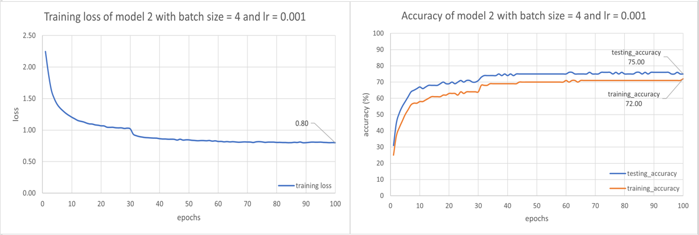
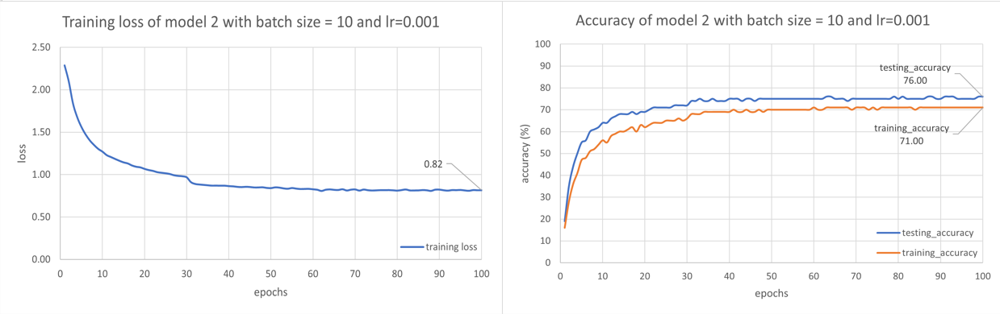
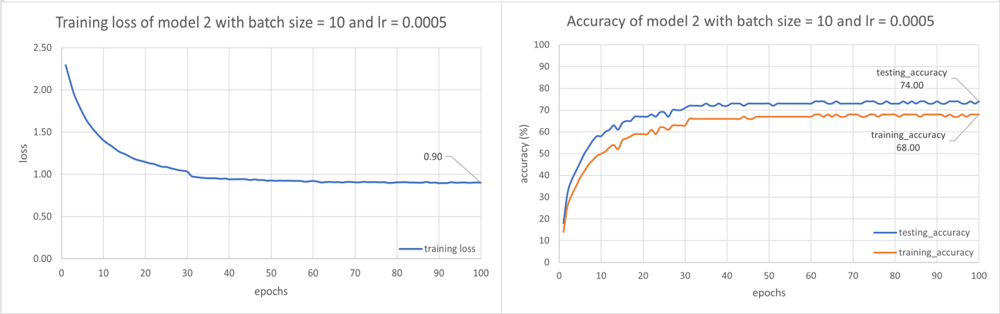

# Lab Assignment 2

## Requirement 

This assignment require one to build a **Convolutional Neural Network (CNN) model** to classify a CIFAR-10 dataset. In this assignment, Pytorch and Tensorflow is **allowed** to use.

In this assignment, one also requires to

1. Plot the learning curves and the accuracy of classification versus the number of epochs until convergence for training data as well as test data.

2. Repeat 1 with different batch sizes.

3. Repeat 1 with different learning rates

## Results and Conclusion

In this assignment, I learnt how to use Pytorch library to implement the deep learning model. Next, this assignment also increase my knowledge on CNN model, including how a kernel act as a feature extractor.

### Result on accuracy and loss when different batch size

- batch size=4

- batch size=10

Above shows the results for the four requirements above. From the figure below, I noticed that unlike the previous assignment, in this assignment changing batch size from 4 to 10 **does not** really affect the performance very much.

### Result on accuracy and loss when different batch size

- learning rate = 0.001

- learning rate = 0.0005

Next, decrease the learning rate by half also does not affect the result very much. When decreasing the learning rate by half, the performance of the model only drop 2%, which can be seen in the figure above.